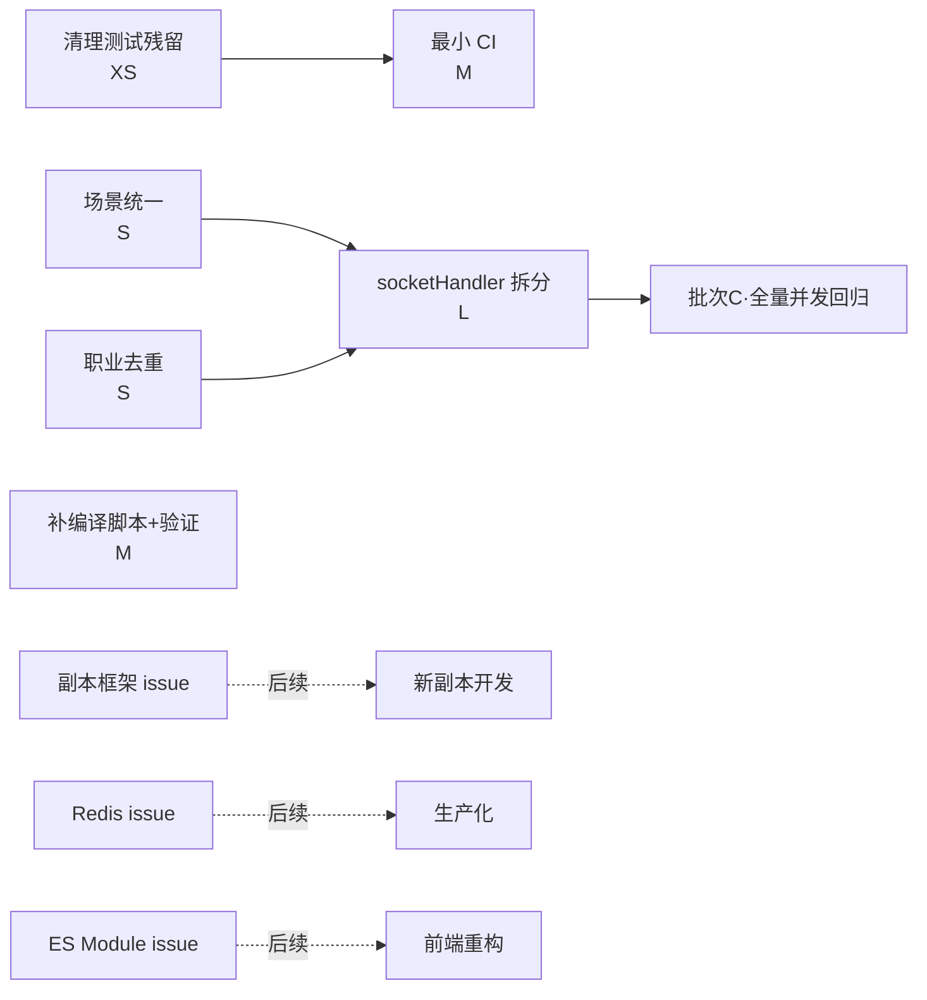

# ADR-006-PLAN · 代码审查问题修复需求澄清文档

**状态**：`accepted`（2026-08-07 已批准，任务计划见 ADR-007，已全部完成）
**创建日期**：2026-08-07
**澄清人**：clarifier 子 Agent

## 一、事实核对结果（全部基于源码核实）

| # | 报告问题 | 核实结论 | 核实依据 | 补充发现 |
|---|---------|---------|---------|---------|
| P0-1 | 硬编码场景映射 | **确认，且比报告更严重** | `server.js` L78-125 两处硬编码仅覆盖 **7 场景**；`config/scenes.json` 有 **≥11 场景**且字段结构完全不同 | **`server/gameLogic.js` L66-70 已读取 `scenes.json`** 并实现 `matchSceneByTags` 标签匹配——单一数据源**已存在**，`server.js` 两路由纯属冗余硬编码 |
| P0-2 | 重复职业定义 | **确认** | `server/gameLogic.js` L5-22 `CAREERS` 硬编码 11 职业；`config/professions.json` 含完整结构 | `CAREERS` 仅是 professions.json 的**精简投影**（键为中文名，professions 用拼音 id + name），`socketHandler.js` L282、`createNewPlayer` L126 依赖 `CAREERS[career].bonus/passive/skills` |
| P1-3 | C++ 编译状态未知 | **确认未编译，且未接入运行时** | 全库 **0 个 `.node` 产物**；`package.json` 无 node-gyp / node-addon-api / build 脚本 | `binding.gyp` 引用了 `node-addon-api` include，但**未在 package.json 声明依赖**；`server/` 与 `frontend/` **均不引用** `BattleBridge/battleCore/src/battle`——该引擎仅被 `native/test/test_engine.js` 与 `docs/` 引用，是"性能预置方案"；运行时实际用前端 `window.BattleSystem`（`frontend/js/battle.js`） |
| P1-4 | socketHandler.js 臃肿 | **确认，规模被低估** | 实际 **>1560 行**（报告称 1438），**33 个 `socket.on`** 事件承载全部领域逻辑 | 已含 auth/角色/大厅/房间/副本/战斗/投票/商店/背包/KP 交互；状态（`hallRooms/gameRooms/playerHallMap`）全部模块级 Map |
| P1-5 | client.js 前端巨石 | **确认** | 实际 **>1880 行**；`index.html` 用经典 `<script src>` 标签加载（**非 ES Module**） | 项目已有 `window.*` 全局模式拆分（roomHall/isometricBg/goldParticles 等），ES Module 全量改造需重写所有 script 标签与全局引用 |
| P2-6 | 副本引擎耦合低、代码重复 | **确认** | `qingfengTrain.js` **499 行**单副本专属引擎；`dungeonOutlines.js` 存大纲；`startCopy/dungeonAction` 与 qingfengTrain 状态结构强耦合 | 抽象通用副本框架属于大重构，涉及运行时主路径 |
| P2-7 | 会话内存 Map | **确认** | `server/auth.js` L13 `sessions = new Map()`，24h 过期、每小时清理 | 注释已自述"生产应使用 Redis 等"；房间状态同为内存 Map |
| P2-8 | test_demo.txt 残留 | **确认，且不止一个** | `test_demo.txt` 内容仅"文件读写测试成功。" | 根目录另有 `test_round1.js`（迭代验证）、`concurrency_test.js`（并发测试，依赖已装的 socket.io-client）、`test_t2_verify.py`（conda 静态检查）——后三者是**有效测试资产**；`.gitignore` 未覆盖任何测试残留 |

## 二、澄清结论（推荐）

### a. 分批策略：3 批 + 2 项长期 issue

- **批次 A（本期必修，P0 + 顺手清理）**：T1 场景统一、T2 职业去重、T6 测试残留清理。低风险、高价值、回归面小。
- **批次 B（本期纳入，验证类）**：T3 C++ 模块状态确认（补编译脚本 + JS 回退验证），**不接入运行时**。
- **批次 C（本期可选项，需编排器在规划阶段人工决策）**：T4 socketHandler 拆分（建议纳入，配并发回归）、T9 最小 CI（若 T4 纳入则建议同步纳入）。
- **长期 issue（本期不纳入，仅记录）**：T7 副本框架抽象（XL）、T8 Redis 会话（L）、T5 ES Module 全量拆分（L 高风险，仅记录）。

### b. 每项最小可行修复方案

- **T1 场景映射（已按 reviewer 3 项阻塞澄清修订）**：**统一为单一数据源** = 消除 **3 处硬编码**（`server.js` 两路由 + `sceneLoader.js COPY_SCENE_MAP`），全部由 `config/scenes.json` 派生；`scenes.json` 增补 `overlay`/`label` 后作为唯一事实源（复用 `gameLogic.js` 已加载的 `SCENES`，避免二次读文件）。
  - **数据源扩充（scenes.json，11 条）**：每场景增补 `overlay`（= `'copy-' + id`，确定性派生，7/7 与现值一致）与 `label`（显式策展值：7 个现有场景逐字沿用现值，4 个新增场景建议 `tunnel_crypt→石砌隧道 · 古老回廊`、`village_house→荒村民居 · 阴影之家`、`altar_ruin→古老祭坛 · 血色献祭`、`rift_edge→异界裂隙 · 疯狂之门`；缺失兜底 = `name`）。
  - **决策 A（纳入 sceneLoader.js）**：删 `sceneLoader.js` L25-73 `COPY_SCENE_MAP`，init 时 `fetch('/api/scenes')` 构建运行时映射（`bgPath/overlayClass/label/tags`）；`switchTo/clear/getCopySceneMap` API 与现行行为不变。依据：sceneLoader 为**休眠路径**（键=场景名 vs socket `copyName`=副本名，两集合不相交，`switchTo` 恒走"未知→clear()"），改造零渲染回归。`bgSwitcher.js DUNGEON_BG_POOL`（第 4 份，副本名键/多图池）语义不同，**不纳入 T1**，记录 issue。
  - **决策 B（派生规则）**：`overlay='copy-'+id`（确定性，7/7 一致，无需数据补充）；`label` **不可机械派生**（策展昵称），故 scenes.json 增补显式 `label` 字段，7 个现有场景新旧值 100% 一致。
  - **决策 C（孤儿端点保留+复活）**：两端点**保留**并成为 scenes.json 的 HTTP 投递口（非 YAGNI 删除，grep 确认全库无运行时调用方）；`/api/scenes` 响应字段基准取 **sceneLoader 结构**（`{bgPath, overlayClass, label, tags}`，键=场景名）；`/api/scene/:copyName` 沿用 `{imgUrl, sceneDesc}` 投影自 scenes.json；新增 4 副本返回 success 属预期扩展（7→11），未知名仍 `{success:false}`。
- **T2 职业去重**：`gameLogic.js` 删除手写 `CAREERS`，改为**按职业 `name` 建立索引**的投影函数：`CAREERS = Object.fromEntries(professions.map(p => [p.name, { bonus:p.bonus, passive:p.passive.name, skills:p.skills.map(s=>s.name), hidden:p.hidden }]))`，对外 API（`CAREERS[career].bonus/passive/skills`）完全不变。注意 `hidden` 标志需保留（`环系法师`）。
- **T3 C++ 模块**：目标 = **"补编译脚本 + 验证 JS 回退"**，不做运行时接入。① `package.json` 补 `node-addon-api` devDependency 与 `"build:native"`/`"test:native"` 脚本；② 用 `native/test/test_engine.js` 验证 JS 回退路径全绿；③ **探测** `node-gyp` 是否可用（Windows 需 VS Build Tools + 兼容 Node/Python 版本），可用则实际编译验证 `.node`，不可用则记录编译环境依赖为后续 issue。**不将原生引擎接入 `server/` 运行时**。
- **T4 socketHandler 拆分**：按领域拆 4 模块 `authHandler`/`hallHandler`/`gameHandler`/`battleHandler`，**共享一个 `state.js`**（集中管理 `hallRooms/gameRooms/playerHallMap/deepseekQueues`），socketHandler 保留 `connection` 装配层。粒度到"事件组"而非函数级。
- **T5 client.js 拆分**：**本期不建议 ES Module 全量**。可选低风险增量：按现有 `window.*` 全局模式再抽 1-2 个独立脚本。推荐**记录 issue**。
- **T6 测试残留**：删除 `test_demo.txt`；`test_round1.js`/`concurrency_test.js`/`test_t2_verify.py` 移入 `tests/` 并统一运行文档；`.gitignore` 追加测试产物规则。
- **T7 副本框架抽象**：**不纳入**，记录 issue（当前只有 1 个副本，抽象过早）。
- **T8 Redis 会话**：**不纳入**，记录 issue（涉及部署基础设施）。
- **T9 CI/CD**：最小版 = GitHub Actions workflow（`node --check` 语法 + 现有 JS/Python 测试脚本 + 依赖安装），**依赖 T6 先目录化测试资产**。

### c. 依赖关系与建议执行顺序

- **T1、T2、T6** 相互独立可并行；**T1/T2 需先于 T4**（先稳定 `gameLogic` 数据源，再重构调用方 socketHandler）。
- **T3** 独立于其他所有项，可并行。
- **T4** 依赖 T1/T2 完成；**T9** 依赖 T6。

### d. 风险登记

| 风险 | 等级 | 缓解 |
|-----|------|------|
| T1 改投影后前端字段不兼容 | 低 | 原"保持响应字段逐字段一致"前提已被证伪（端点无人调用），约束改为"保持 sceneLoader 行为不变"；sceneLoader 为休眠路径，零回归 |
| T1 前端改 fetch /api/scenes 的异步初始化竞态 | 低 | fetch 失败回退空映射+`clear()`（保持现行为）；`copyStart` 晚于页面 init 触发，无竞态窗口 |
| T2 职业投影丢失 `hidden`/技能名 | 中 | 投影保留 `hidden`；用 `test_round1.js` 级断言校验 11 职业字段 |
| T3 Windows 下 node-gyp 无 VS Build Tools | 高 | 先探测再编译；不可行则降级为"仅 JS 回退验证 + 记录 issue"，**不阻塞批次** |
| T4 socketHandler 拆分回归 | **高** | 状态集中到 `state.js` 后，用 `concurrency_test.js`（socket.io-client 已装）做多用户并发回归 + 手动流程冒烟 |
| T9 最小 CI 误伤（conda 环境不可用） | 中 | CI 用 `python -m py_compile`/静态检查替代运行 Python 全量测试 |

## 三、问题清单总表

| 任务 | 严重度 | 现状核实 | 建议方案 | 工作量 | 本期纳入 |
|------|-------|---------|---------|-------|---------|
| T1 场景映射统一 | P0 | ✅ 确认（双硬编码 vs 已存在 scenes.json） | 删 3 处硬编码→scenes.json 增补 overlay/label→server 投影 + sceneLoader 消费 /api/scenes | S | ✅ 批次A |
| T2 职业去重 | P0 | ✅ 确认 | gameLogic 投影 professions.json，对外 API 不变 | S | ✅ 批次A |
| T3 C++ 编译验证 | P1 | ✅ 确认未编译且未接入运行时 | 补脚本+JS 回退验证，编译可行则验，不可行记 issue | M | ✅ 批次B |
| T4 socketHandler 拆分 | P1 | ✅ 确认（>1560 行/33 事件） | state.js 共享 + 4 领域模块 | L | ⚠️ 批次C（需编排器决策） |
| T5 client.js 拆分 | P1 | ✅ 确认（>1880 行/script 标签） | 本期仅增量抽脚本或记 issue | L | ❌ 记 issue |
| T6 测试残留清理 | P2 | ✅ 确认（含 4 个文件） | 删 test_demo.txt + 其余入 tests/ + 补 .gitignore | XS | ✅ 批次A |
| T7 副本框架抽象 | P2 | ✅ 确认（单副本引擎耦合） | 记录 issue，待多副本驱动 | XL | ❌ 记 issue |
| T8 Redis 会话 | P2 | ✅ 确认（内存 Map） | 记录 issue，待生产化 | L | ❌ 记 issue |
| T9 CI/CD | P3 | ✅ 确认（无 workflows/test 脚本） | 最小 GitHub Actions（依赖 T6） | M | ⚠️ 随 T4 决策 |
