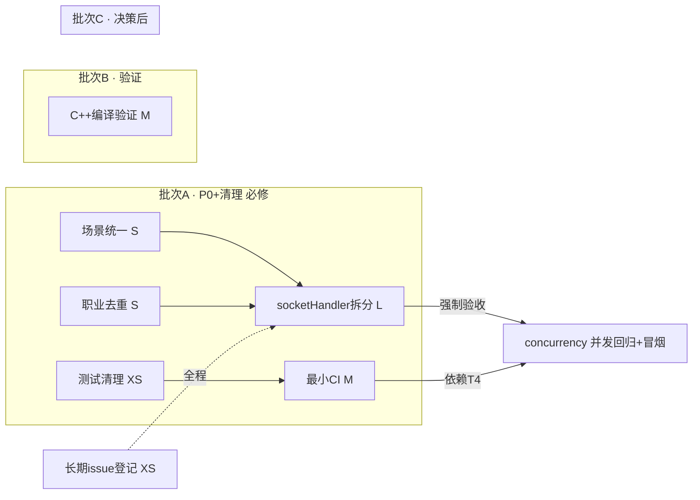

# ADR-007-PLAN · 代码审查问题修复任务计划

**状态**：✅ **COMPLETED**（2026-08-07 全部 7 任务完成：T-1/T-2/T-4 批次A、T-3 批次B、T-5/T-6 批次C、T-7 长期 issue 登记）
**创建日期**：2026-08-07
**规划人**：planner 子 Agent
**上游文档**：[ADR-006](./ADR-006-PLAN-代码审查问题修复.md)（需求澄清，8 项问题已核实）

> 本计划仅可写：任务计划文档、`.agent/memory/`、`.agent/reports/`。**禁止修改源码**。文件增删由 Orchestrator 在方案批准后执行。

---

## 一、元信息

- 目标：解决 ADR-006 核实确认的 **8 项代码审查问题**，按 3 批推进（A 必修 / B 验证 / C 决策）。
- 范围边界：本期**不接入** C++ 原生引擎到运行时（T-3）；**不纳入** ES Module 全量拆分（T-5）、副本框架抽象（T-7）、Redis（T-8），仅登记为长期 issue。
- 数据源核实（本规划已实地抽查，与 ADR-006 一致）：
  - `server.js` `/api/scenes` + `/api/scene/:copyName` 两路由硬编码 **7 场景**；`config/scenes.json` **恰 11 场景**（7 现有 + 4 新增）。
  - `server/gameLogic.js` L5-22 手写 `CAREERS`（11 职业，含 `hidden` 环系法师）；`config/professions.json` 为完整事实源。
  - `public/js/sceneLoader.js` L25-73 `COPY_SCENE_MAP`（7 场景）；`public/css/sceneSwitch.css` 定义了 7 个 overlay 类（连字符命名）。
  - `server/socketHandler.js` **1438 行 / 32 个 `socket.on`**（ADR 记 33，已逐一核对为 32）+ 4 个模块级 Map（`hallRooms/gameRooms/playerHallMap/deepseekQueues`）。
  - 测试资产：根目录 `test_demo.txt`（残留）、`test_round1.js`、`concurrency_test.js`、`test_t2_verify.py`；**无 `tests/` 目录**；**无 `.github/workflows/`**。

---

## 二、批次 C 决策建议（需 Orchestrator 最终拍板）

**建议：全量纳入 —— T-5（socketHandler 拆分）与 T-6（最小 CI）同步纳入本期。**

| 决策项 | 建议 | 理由 | 前置 / 强制验收 |
|--------|------|------|----------------|
| T-5 socketHandler 拆分 | ✅ **纳入** | ① P1 级技术债：1438 行 / 32 事件单片承载全部领域逻辑，后续每加一功能继续膨胀；② T-1/T-2 完成后数据源稳定，此时重构调用方窗口最优；③ 已有 `concurrency_test.js`（socket.io-client 已装）可作**强制并发回归**，风险可控 | 依赖 T-1、T-2（数据源稳定）→ 再重构；**强制验收**：`concurrency_test.js` 多用户并发全绿 + 手工冒烟清单通过 |
| T-6 最小 CI | ✅ **同步纳入** | 依赖 T-6 先目录化测试资产（T-4），CI 才有稳定输入；CI 同时成为 T-5 重构后的自动回归网 | 依赖 T-4；失败兜底见 T-6 验收 |

**降级预案**（若 Orchestrator 评估 T-5 风险不可接受）：
- T-5 不纳入：仅登记 issue，**T-6 仍建议以最小形态纳入**（`node --check` + `test_round1.js`，成本极低、防回归收益确定）。
- 若 T-5 纳入但 T-6 缓推：T-5 的并发回归改由人工执行 `concurrency_test.js`（需本地起 server）。

---

## 三、任务清单总表

| ID | 标题 | 类别 | 优先级 | 批次 | 依赖 | 预估工作量 |
|----|------|------|--------|------|------|-----------|
| T-1 | 场景映射统一为单一数据源 | 后端+配置+前端 | P0 | A | —（独立） | S |
| T-2 | 职业数据去重（投影 professions.json） | 后端 | P0 | A | —（独立） | S |
| T-3 | C++ 模块编译验证（不接入运行时） | C++/配置 | P1 | B | —（独立） | M |
| T-4 | 测试残留清理（目录化 + .gitignore） | 测试/配置 | P2 | A | —（独立） | XS |
| T-5 | socketHandler 领域拆分 | 后端 | P1 | C | **T-1、T-2** | L |
| T-6 | 最小 GitHub Actions CI | CI | P3 | C | **T-4** | M |
| T-7 | 长期 issue 登记（T5/T7/T8/bgSwitcher/编译环境） | 文档 | — | 全程 | — | XS |

> 批次 A（T-1/T-2/T-4）与批次 B（T-3）相互独立，可并行开工；T-7 随时可做。

---

## 四、依赖拓扑与执行顺序



**执行顺序建议**：
1. 批次 A **并行**启动：T-1、T-2、T-4（互不依赖）。
2. 批次 B：T-3 与批次 A 并行。
3. 批次 C：T-5 在 **T-1 + T-2 完成后**开始；T-6 在 **T-4 完成后**开始。
4. 全量并发回归 + 手工冒烟作为 T-5 强制出口；T-7 贯穿登记。

---

## 五、任务详案

### T-1 场景映射统一为单一数据源

- **ID**：T-1　**类别**：后端 + 配置 + 前端　**优先级**：P0　**批次**：A　**依赖**：无
- **涉及文件**：
  - `server.js`（修改：删除两路由硬编码，改投影）
  - `config/scenes.json`（修改：增补 `overlay` / `label` 字段，11 条）
  - `public/js/sceneLoader.js`（修改：删 `COPY_SCENE_MAP`，init 时 `fetch('/api/scenes')`）
  - `public/css/sceneSwitch.css`（**不修改**，仅核对 7 类名）
  - `server/gameLogic.js`（**只读复用**其已加载的 `SCENES`，不重复读文件）
- **修改方案要点**：
  1. **scenes.json 增补字段**（11 条）：
     - `overlay`：**派生规则（已修正 ADR-006 字面表述）** = `'copy-' + id.replace(/_/g, '-')`（id 为下划线、CSS 类为连字符，必须规范化）。按此规则 7 个现有场景与 `server.js`/`sceneLoader.js`/`sceneSwitch.css` 现值 **7/7 一致**（例：`underwater_altar → copy-underwater-altar`）。
     - `label`：显式策展值，不可机械派生。现 7 场景逐字沿用现值；4 新场景建议：`tunnel_crypt→石砌隧道 · 古老回廊`、`village_house→荒村民居 · 阴影之家`、`altar_ruin→古老祭坛 · 血色献祭`、`rift_edge→异界裂隙 · 疯狂之门`。缺失兜底 = `name`。
  2. **server.js 两端点改为投影**（复用 `require('./server/gamelogic').SCENES`，避免二次读文件）：
     - `/api/scenes`：按 `name` 为键，输出 sceneLoader 结构 `{ id, bgPath, overlayClass, label, tags }`（`bgPath=bg`、`overlayClass=overlay`、`tags=sceneTags`），11 条全量。
     - `/api/scene/:copyName`：按 `name` 为键，输出 `{ imgUrl: bg, sceneDesc: description }`；未知名仍 `{ success:false }`。删除已死的 `require('./server/room')`/`matchSceneImage` 引用（若确认无用）。
  3. **sceneLoader.js**：删 `COPY_SCENE_MAP`（L25-73）；`init()` 内 `fetch('/api/scenes')` 构建运行时映射；`switchTo/clear/getCopySceneMap` API 与 socket 事件绑定行为**完全不变**；fetch 失败回退空映射 + `clear()`（保持现行为，休眠路径零回归）。
  4. `bgSwitcher.js DUNGEON_BG_POOL`（第 4 份映射，语义不同）**不纳入本任务**，登记 issue（见 T-7）。
- **验收标准**（可测）：
  - `node --check server.js` 通过。
  - `GET /api/scenes` 返回 **11 条**，每条含 `bgPath/overlayClass/label/tags`；7 个现有场景各字段**值**与改前逐字一致（注：字段名 `overlay`→`overlayClass`、`bg`→`bgPath`、`sceneTags`→`tags` 为投影改名，**值**不变）。
  - `GET /api/scene/:copyName`：7 旧名返回与改前一致；4 新名返回 `success:true`；未知名返回 `{success:false}`。
  - sceneLoader：7 现有场景 `switchTo` 正常切换；未知名走 `clear()`；`getCopySceneMap()` 返回 11 条。
  - 运行 `node tests/test_round1.js`（T-4 迁移后）全绿（该文件不含 SCENES 断言，仅作回归网）。

### T-2 职业数据去重（投影 professions.json）

- **ID**：T-2　**类别**：后端　**优先级**：P0　**批次**：A　**依赖**：无
- **涉及文件**：
  - `server/gameLogic.js`（修改：删手写 `CAREERS`，改投影函数）
  - `config/professions.json`（**只读**事实源）
- **修改方案要点**：
  1. 删除 L5-22 手写 `CAREERS`。
  2. 新增投影（保持**对外 API 完全不变**，含 `hidden` 标志）：
     ```js
     const PROFESSIONS = require('../config/professions.json');
     const CAREERS = Object.fromEntries(PROFESSIONS.map(p => [
       p.name, { bonus: p.bonus, passive: p.passive.name, skills: p.skills.map(s => s.name), hidden: p.hidden }
     ]));
     ```
  3. 消费方（`createNewPlayer` L126 的 `.bonus/.skills`、`socketHandler.js` L282 `createCharacter` 的 `.skills`）**无需改动**。
  4. 加注释说明投影来源，避免未来再度手写。
- **验收标准**（可测）：
  - `Object.keys(CAREERS).length === 11`，含 `环系法师` 且 `hidden === true`。
  - 每个职业 `bonus/passive/skills` 与 `professions.json` 逐字段一致（新增断言）。
  - `createCharacter` 用各职业创建角色，`skills` 均正确填充。
  - `node --check server/gameLogic.js` 通过；`tests/test_round1.js` 全绿。

### T-3 C++ 模块编译验证（不接入运行时）

- **ID**：T-3　**类别**：C++ / 配置　**优先级**：P1　**批次**：B　**依赖**：无
- **涉及文件**：
  - `package.json`（修改：补 `node-addon-api` devDependency + `build:native`/`test:native` 脚本）
  - `native/binding.gyp`（**只读**，已引用 node-addon-api include）
  - `native/test/test_engine.js`（**只运行不修改**，已含 C++→JS 回退双分支）
- **修改方案要点**：
  1. `package.json` 增 `"node-addon-api": "^7.0.0"`（devDependencies）与脚本：
     ```json
     "build:native": "node-gyp rebuild --directory=native",
     "test:native": "node native/test/test_engine.js"
     ```
  2. 验证 JS 回退路径：`node --check native/test/test_engine.js` + `npm run test:native`（无 `.node` 产物时自动回退 `src/battle/BattleBridge`），要求全绿。
  3. **探测** node-gyp 可行性（Windows 需 VS Build Tools + 兼容 Node/Python 版本）：执行 `npx node-gyp rebuild --directory=native`；**可行** → 实际编译 `native/build/Release/battle_engine.node` 并重跑 `npm run test:native` 验证 C++ 分支；**不可行** → 记录编译环境依赖为 issue（见 T-7），**不阻塞批次、不接入 `server/` 运行时**。
- **验收标准**（可测）：
  - `package.json` 含 `build:native` / `test:native` 脚本与 node-addon-api 依赖。
  - JS 回退路径 `npm run test:native` 全绿。
  - 探测结论已记录：编译成功（附 `.node` 产物路径）或登记编译环境 issue。

### T-4 测试残留清理（目录化 + .gitignore）

- **ID**：T-4　**类别**：测试 / 配置　**优先级**：P2　**批次**：A　**依赖**：无
- **涉及文件**：
  - `test_demo.txt`（**删除**）
  - `test_round1.js`、`concurrency_test.js`、`test_t2_verify.py`（**移入 `tests/`**，改相对路径）
  - `.gitignore`（追加测试产物规则）
  - `tests/README.md`（新建：运行文档）
- **修改方案要点**：
  1. 删除 `test_demo.txt`（内容仅"文件读写测试成功。"，纯残留）。
  2. 新建 `tests/`，迁入 3 个测试文件并修正路径：
     - `test_round1.js`：`require('./server/gamelogic')` → `require('../server/gamelogic')`；`require('./server/storage')` → `require('../server/storage')`；**`require('./server/battleCore')` → `require('../server/battleCore')`**（注意：该 require 在 T2 try 块内，路径不修正会被 try/catch **静默吞掉**致 battleCore 用例形同虚设；保持小写 `gamelogic`，与现存 require 约定一致）。
     - `test_t2_verify.py`：`ROOT = os.path.dirname(os.path.abspath(__file__))` 读取的相对路径需上移一级 → `os.path.dirname(os.path.dirname(os.path.abspath(__file__)))`（静态检查读取 `server/socketHandler.js` 与 `frontend/js/client.js`）。
     - `concurrency_test.js`：无相对 require，仅移动即可（依赖 `socket.io-client` 已装）。
  3. `.gitignore` 追加：`native/build/`、`*.node`（构建产物）、`tests/__pycache__/`、`*.log` 等。
  4. 新建 `tests/README.md`：记录运行方式（JS：`node tests/test_round1.js` / `node tests/concurrency_test.js 5 all`（需先起 server）；Python：`conda run -n coc_rpg_env python tests/test_t2_verify.py`）。
- **验收标准**（可测）：
  - `test_demo.txt` 不存在；3 测试文件位于 `tests/`。
  - `node tests/test_round1.js` 独立运行全绿（路径已修正），**且 battleCore 用例真实执行**（可加 `console.log` 或断言计数验证非 try/catch 静默跳过）。
  - `conda run -n coc_rpg_env python tests/test_t2_verify.py` 独立运行全绿（ROOT 已修正）。
  - `.gitignore` 含上述规则；`tests/README.md` 存在。

### T-5 socketHandler 领域拆分（批次 C · 大重构）

- **ID**：T-5　**类别**：后端　**优先级**：P1　**批次**：C　**依赖**：**T-1、T-2**（数据源稳定后再重构调用方）
- **涉及文件**：
  - 新建 `server/state.js`（共享状态）
  - 新建 `server/authHandler.js`、`server/hallHandler.js`、`server/playerHandler.js`、`server/gameHandler.js`、`server/battleHandler.js`
  - 修改 `server/socketHandler.js`（退化为 `connection` 装配层 + `disconnect` 生命周期）
- **修改方案要点**：
  1. **`state.js`**：集中管理 `hallRooms/gameRooms/playerHallMap/deepseekQueues` 4 个模块级 Map + `enqueueDeepSeek` 辅助函数（被多 handler 复用）。提供最小访问辅助（如 `getPlayerHall/setPlayerHall`），不暴露可变裸 Map 亦可，取决于实现偏好——**行为等价是硬约束**。**共享 helper 统一归属 state.js**：`removePlayerFromHall`（L132）、`getPublicRoomSummaries`（L54）、`generateRoomId`、`generateRoomCode`、`snapshotState` 均移入 state.js（或独立 `server/helpers.js`），**不留在装配层**，确保装配层 <200 行验收达标。
  2. **事件归属拆分（粒度=事件组）**：

| Handler | 事件（socket.on） | 领域 |
|---------|------------------|------|
| `authHandler` | register, login, autoLogin, getCharacterList, createCharacter, selectCharacter, deleteCharacter, updateAvatar（8） | 认证 + 角色 |
| `hallHandler` | getRoomList, createRoom, joinPublicRoom, joinRoomByCode, leaveRoom, kickPlayer, syncRoomState（7） | 大厅 / 房间 |
| `playerHandler` | getShopItems, buyItem, getInventory, equipItem, dropItem（5） | 商店 / 背包（纯玩家账户操作，不触 hall 状态） |
| `gameHandler` | startCopy, dungeonAction, completeCopy, applySettlementPoints, teamChat, teamVote（6） | 副本 / 结算 / 聊天 / 投票 |
| `battleHandler` | playerAction, chooseStatOption, privateAction, useSkill, groupAction（5） | 战斗 / KP 交互 |
| `socketHandler` | disconnect + 事件接线（32 事件全部装配） | connection 生命周期 |

  3. 各 handler 导出 `register<Domain>(socket, io, state)` 注册函数；`socketHandler.js` 保留 `registerSocketEvents(io)` 按序装配。
  4. **行为零变化**：事件名、载荷、`socket.emit` 方向与字段、报错语义、状态读写完全一致；不改任何业务逻辑。
- **验收标准**（可测，**强制**）：
  - `socketHandler.js` 行数显著下降（装配层目标 <200 行；各 handler <600 行/个）。
  - `node --check` 全部涉及文件通过；`node tests/test_round1.js` 全绿。
  - **`node tests/concurrency_test.js 5 all` 并发回归全绿**（多用户同时连接/登录/入房/playerAction/断线重连），T-5 的唯一出口。
  - 手工冒烟清单通过：注册→登录→建角色→建房→入房→开副本→战斗动作→结算→返回大厅→退出（见 §八）。
  - 32 个事件逐一核对已迁移且语义不变（可对照 `git diff` 前后事件表）。

### T-6 最小 GitHub Actions CI（批次 C）

- **ID**：T-6　**类别**：CI　**优先级**：P3　**批次**：C　**依赖**：**T-4**（先目录化测试资产）
- **涉及文件**：新建 `.github/workflows/ci.yml`
- **修改方案要点**（最小形态，防误伤）：
  1. 触发：`push` / `pull_request`（`main` 及任意分支）。
  2. 步骤：
     - `actions/checkout@v4` + `actions/setup-node@v4`（Node LTS）+ `npm ci`。
     - **语法检查**：`node --check` 关键文件（`server.js`、`server/*.js`、`public/js/*.js`、`tests/*.js`）。
     - **JS 单元测试**：`node tests/test_round1.js`。
     - **Python 静态检查**：`python -m py_compile tests/test_t2_verify.py`（**不运行**全量 Python，避免 conda 环境依赖导致误伤）。
  3. `concurrency_test.js` **不进 CI 默认步骤**（需起 server，成本高）；可加手动触发 workflow_dispatch 变体（可选）。
- **验收标准**（可测）：
  - workflow 在 push/PR 时触发且全绿。
  - 至少包含：依赖安装、`node --check`、JS 单元测试、Python `py_compile` 四类步骤。
  - CI 中不依赖 conda `coc_rpg_env` 运行时（仅静态编译检查）。

### T-7 长期 issue 登记（本期不实施）

- **ID**：T-7　**类别**：文档　**优先级**：—　**批次**：全程　**依赖**：无
- **涉及文件**：`.agent/memory/adr/` 或 issue 列表（由 Orchestrator 创建 GitHub Issue）
- **登记清单**：见 §十（5 项：T5 ES Module、T7 副本框架、T8 Redis、bgSwitcher 第 4 份映射、T-3 编译环境依赖[若探测不可行]）。
- **验收标准**：5 项均以 ID/描述/预估工作量/触发条件登记在案，本期不实施。

---

## 六、关键实现细节与修正（相对 ADR-006）

1. **overlay 派生规则修正**：ADR-006 写 `overlay='copy-'+id`（字面 7/7 一致），但实测 `scenes.json` id 用下划线（`underwater_altar`）、CSS 类/现值用连字符（`copy-underwater-altar`）。**必须** `'copy-' + id.replace(/_/g, '-')` 才 7/7 一致。此为 ADR-006 的一个技术性修正，已在 T-1 固化。
2. **场景数量**：ADR-006 记"≥11"，实测恰 **11**（7 现有 + 4 新增：`tunnel_crypt/village_house/altar_ruin/rift_edge`）。
3. **socket.on 数量**：ADR-006 记 33，逐一核对实测 **32**；计划按 32 处理，验收以"事件表前后一致"为准。
4. **require 大小写约定**：现库 `require('./gamelogic')`（小写 l）、文件 `server/gameLogic.js`；Windows 大小写不敏感可运行，**迁移/新增代码统一沿用 `./gamelogic` 小写**，避免跨平台差异。
5. **4 个新场景 overlay 无对应 CSS 类**：因 sceneLoader 为休眠路径（键=场景名与 socket `copyName`=副本名不相交），4 新场景仅经 HTTP 端点暴露、不会实际渲染 overlay；可接受，如需可见效果另开 issue 补 CSS（不阻塞 T-1）。

---

## 七、开发约定（本计划所有代码任务遵循）

- **主业务语言**：JavaScript（后端 `server/`、`server.js`）与 C++（`native/` 战斗引擎，仅 T-3 编译验证，不接入运行时）。
- **Python 定位**：仅用于测试/静态检查（`test_t2_verify.py`），运行环境固定为 conda `coc_rpg_env`（`E:\miniconda3\envs\coc_rpg_env\python.exe`）；CI 中退化为 `python -m py_compile` 避免环境依赖误伤。
- 所有 JS 改动后执行 `node --check`；所有后端改动需过 `tests/test_round1.js` 回归；T-5 强制 `concurrency_test.js` 并发回归。

---

## 八、验收与回归策略

| 关卡 | 覆盖任务 | 执行方式 |
|------|---------|---------|
| 语法门禁 | T-1/T-2/T-3/T-5 | `node --check` 全部改动文件 |
| 单元回归 | T-1/T-2/T-5 | `node tests/test_round1.js` 全绿 |
| 原生回退 | T-3 | `npm run test:native`（JS 回退分支） |
| Python 静态 | T-4 | `conda run -n coc_rpg_env python tests/test_t2_verify.py` |
| **并发回归（强制出口）** | **T-5** | `node tests/concurrency_test.js 5 all`（先起 `node server.js`） |
| 手工冒烟 | T-5（+ T-1/T-2 全量） | 注册→登录→建角色（各职业）→建房→入房→开副本→场景切换→战斗动作→结算→商店/背包→返回大厅→退出 |

---

## 九、风险登记

| 风险 | 等级 | 缓解 |
|------|------|------|
| T-1 overlay 派生规则与现值不一致 | 中 | 已修正为 `id.replace(/_/g,'-')`；验收含 7/7 逐字一致断言 |
| T-1 sceneLoader fetch 异步竞态 | 低 | 休眠路径 + fetch 失败回退空映射/`clear()`；`copyStart` 晚于页面 init |
| T-2 投影丢失 hidden/技能名 | 中 | 投影保留 `hidden`；新增 11 职业断言校验 |
| T-3 Windows node-gyp 无 VS Build Tools | 高 | 先探测再编译；不可行降级为 JS 回退验证 + 登记 issue，不阻塞 |
| T-5 拆分回归 | **高** | state.js 集中状态；**concurrency_test.js 并发回归为强制出口** + 手工冒烟清单 |
| T-6 最小 CI 误伤（conda 不可用） | 中 | CI 用 `python -m py_compile` 静态替代运行全量 Python |
| 4 新场景 overlay 无 CSS | 低 | 休眠路径不渲染，可接受；如需可见另开 issue |

---

## 十、长期 issue 登记表（本期不实施，T-7 落地）

| Issue | 来源 | 预估 | 触发/实施条件 |
|-------|------|------|--------------|
| client.js ES Module 全量拆分 | ADR T5 | L（高风险） | 前端重构窗口；当前可按 `window.*` 全局模式增量抽 1-2 脚本 |
| 副本框架抽象（通用引擎） | ADR T7 | XL | 第 2 个副本需求驱动（当前仅 qingfengTrain 1 个，抽象过早） |
| Redis 会话/房间状态 | ADR T8 | L | 生产化部署时（当前内存 Map + 24h 过期已自述"生产应使用 Redis"） |
| bgSwitcher `DUNGEON_BG_POOL` 第 4 份映射 | T-1 排除项 | S | 与 scenes.json 统一或独立维护（副本名键/多图池，语义不同） |
| C++ 编译环境依赖（若 T-3 探测不可行） | T-3 降级项 | M | 安装 VS Build Tools + 兼容工具链后复测 |

---

## 十一、待创建 GitHub Issue（由 Orchestrator 创建并回填编号）

1. `T-1` 场景映射统一为单一数据源（P0）
2. `T-2` 职业数据去重（P0）
3. `T-3` C++ 模块编译验证（P1）
4. `T-4` 测试残留清理（P2）
5. `T-5` socketHandler 领域拆分（P1，批次 C 待决策）
6. `T-6` 最小 CI（P3，批次 C 待决策）
7. `T-7` 长期 issue 登记（含 §十 5 项）
