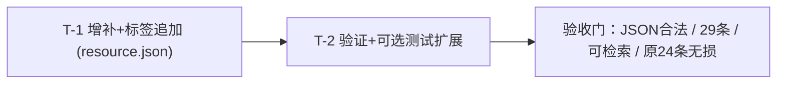

# ADR-009-PLAN · 资源增补任务计划（resource.json）

**状态**：✅ **COMPLETED**（2026-08-07 全部完成：T-1 resource.json 24→29 条、T-2 验收 + 测试扩展 44/44）
**创建日期**：2026-08-07
**规划人**：planner 子 Agent
**上游文档**：[ADR-008](./ADR-008-PLAN-资源增补与标签修正.md)（需求澄清，用户已拍板 3 个决策点）

> 本计划仅可写：任务计划文档、`.agent/memory/`、`.agent/reports/`。**禁止修改 resource.json / 源码**。文件内容改动由 Coder 在批准后执行；物理图片由用户另行提供，不在代码交付内。

---

## 一、元信息

- **目标**：`resource.json` 由 **24 → 29 条**（+5 新增），并按 ADR-008 追加标签；不改任何源码、不改任何已有 url。
- **范围边界**：仅注册表改动 + 验证；方尖碑 GIF **不纳入**（用户已确认）；`matchResource`/加载器逻辑**不改**；物理 PNG **不交付**。
- **用户已拍板**：
  1. 方尖碑不纳入 ✅
  2. "扣散异象"按原文 ✅（不做"扣SAN异象"改写）
  3. `wil_icon` **纳入** C 组追加 ✅（共 7 个图标）
- **数据源核实（本规划已逐条实地比对 `resource.json`）**：
  - 当前 **24 条** = 14 个 bg 场景 + 2 个 UI 底板（`panel_attr_bg`、`shop_item_bg`）+ 7 个图标（hp/san/str/dex/con/per/wil）+ 1 占位（`placeholder_dark`）。
  - ⚠ **ADR-008 两处过期表述，以文件实际为准**：
    - 第一节"11 个 bg 场景"应更正为 **14 个**（第四节 A 清单所列 14 项与实际文件一致，按此执行）。
    - 第七节"标签追加于 21~22 条"为旧顺序残留表述，无操作意义，忽略。
  - `server/gameLogic.js` L84-103 `ResourceManager` 构造时整读 `./resource.json`，`matchResource(tags)` 按标签交集计数打分、返回**首个最高分**条目的 `url`（同分取数组靠前者）；**新增/改标签无需改代码**。

---

## 二、任务清单总表

| ID | 标题 | 类别 | 优先级 | 依赖 | 涉及文件 | 预估工作量 |
|----|------|------|--------|------|----------|-----------|
| T-1 | `resource.json` 增补 5 条 + 标签追加（A/B/C/D） | 全栈（数据/配置层） | P0 | 无（基于已批准 ADR-008） | `resource.json` | S |
| T-2 | 验收验证（JSON/条目/检索/回归）+ 可选测试扩展 | 后端（测试/验证） | P1 | **T-1** | 只读验证；可选改 `tests/test_round1.js` | XS |

> 批次：T-1（核心改动）→ T-2（验证）。两任务串行，T-2 依赖 T-1 完成后方可执行。改动面极小（单文件 +5/追加标签），无需并行批次。

---

## 三、依赖拓扑与执行顺序



**执行顺序建议**：
1. **T-1**（Coder）：仅改 `resource.json` 一个文件（改前先快照/`git diff` 留底）。
2. **T-2**（Tester，只读）：跑 ADR-008 第六节 6 项验收；可选扩展 `tests/test_round1.js` T6 后跑 `node tests/test_round1.js` 全绿。
3. 两任务完成后由 Orchestrator 收尾（DECIDING→FINISHED）。

---

## 四、任务详案

### T-1 · resource.json 增补 5 条 + 标签追加（A/B/C/D）

- **ID**：T-1　**类别**：全栈（数据/配置层）　**优先级**：P0　**依赖**：无
- **涉及文件**：`resource.json`（**唯一改动文件**，改前快照原 24 条备用）

#### 修改方案要点 ① —— 新增 5 条完整 JSON（按建议 tags 原样注册）

建议插入位置：4 个 `icons/*` 追加到 `wil_icon` 条目之后（图标区）；`panel_team_bg` 追加到 `panel_attr_bg` 之后（UI 底板区）。位置不影响功能（`matchResource` 按标签打分），仅为可维护性。

```json
{
  "resId": "hourglass_action_icon",
  "tags": ["行动次数", "图标", "战斗面板"],
  "url": "./assets/icons/hourglass.png"
}
```
```json
{
  "resId": "check_done_icon",
  "tags": ["完成标记", "对勾", "图标", "战斗面板"],
  "url": "./assets/icons/check_done.png"
}
```
```json
{
  "resId": "down_icon",
  "tags": ["倒地", "HP归零", "图标", "战斗面板"],
  "url": "./assets/icons/down.png"
}
```
```json
{
  "resId": "mad_icon",
  "tags": ["疯狂", "SAN归零", "图标", "战斗面板"],
  "url": "./assets/icons/mad.png"
}
```
```json
{
  "resId": "panel_team_bg",
  "tags": ["UI", "面板", "底板", "小队信息", "战斗面板"],
  "url": "./assets/ui/panel_team_bg.png"
}
```

#### 修改方案要点 ② —— 标签追加（逐条，**只追加、不删除任何既有 tags、不改 url**）

**A. 14 个场景背景**（`url` 均 `./assets/bg/*`，排除 `placeholder_dark`）→ 各追加 `["副本场景","可触发SAN损耗","战斗切换背景"]`：

| resId | 追加后 tags（既有 + 新增） |
|---|---|
| `village_night` | 古代荒村、夜晚、雾气、破旧木屋、野外场景 ＋ 副本场景、可触发SAN损耗、战斗切换背景 |
| `hospital_corridor` | 废弃精神病院、昏暗走廊、血迹、室内、潮湿 ＋ 同上 |
| `ocean_ship` | 幽灵船、大海、雨夜、甲板、航海场景 ＋ 同上 |
| `roman_arena` | 古罗马遗迹、角斗场、废墟、黄昏、古代建筑 ＋ 同上 |
| `abandoned_house` | 废弃古宅、室内大厅、破败家具、阴影、陈旧 ＋ 同上 |
| `cave_dark` | 黑暗洞穴、地下、潮湿岩壁、无光环境、探险 ＋ 同上 |
| `submarine_station` | 深海殖民废弃站、水下、金属走廊、科技遗迹、诡异灯光 ＋ 同上 |
| `lab_ruins` | 封闭废弃研究所、实验室、仪器残骸、昏暗、科技废墟 ＋ 同上 |
| `city_ruins` | 失联都市无人区、城市废墟、迷雾、空荡街道、末日感 ＋ 同上 |
| `twisted_space` | 轮回扭曲时空、异次元、扭曲光线、虚空、超自然 ＋ 同上（再叠加 B 组，见下） |
| `tunnel_crypt` | 地下石隧道、古老遗迹、昏暗、潮湿、克苏鲁 ＋ 同上 |
| `village_house` | 荒村、民居、破旧、阴影、恐怖 ＋ 同上 |
| `altar_ruin` | 古老祭坛、血迹、符文、废墟、祭祀 ＋ 同上 |
| `rift_edge` | 异界裂隙、虚空、扭曲光线、超自然、疯狂 ＋ 同上（再叠加 B 组，见下） |

**B. 高 SAN 专属**（在 A 组之上**再**追加，合计 +5 个新标签）→ `twisted_space`、`rift_edge` 各再追加 `["扣散异象","高SAN消耗场景"]`：

| resId | 追加后新标签合计（A+B） |
|---|---|
| `twisted_space` | 副本场景、可触发SAN损耗、战斗切换背景、扣散异象、高SAN消耗场景 |
| `rift_edge` | 副本场景、可触发SAN损耗、战斗切换背景、扣散异象、高SAN消耗场景 |

**C. 属性/生命图标（7 条，含用户已确认的 `wil_icon`）** → 各追加 `["战斗面板","小队信息"]`：

`hp_icon`、`san_icon`、`str_icon`、`dex_icon`、`con_icon`、`per_icon`、`wil_icon`

**D. UI 底板（1 条）** → `panel_attr_bg` 追加 `["单人属性面板","战斗属性弹窗"]`（与 `panel_team_bg` 的小队标签区分单/小队）。

#### 修改后预期条目构成（29 条 = 24 + 5）

14 bg + 3 ui（`panel_attr_bg`、`panel_team_bg`、`shop_item_bg`）+ 11 icons（原 7 + hourglass/check_done/down/mad）+ 1 placeholder。

#### 验收标准（T-1 完成后立即自查）

1. `node -e "JSON.parse(require('fs').readFileSync('resource.json','utf8')); console.log('JSON OK')"` 无异常输出。
2. 条目数 = **29**。
3. 5 个新 resId 均存在，`url` 与 ADR-008 第三节一致。
4. 标签追加仅"增加"，原 24 条既有 tags 均为新 tags 的子集，url 无一改动。
5. 无新资源落入错误目录（icons → `./assets/icons/`、ui → `./assets/ui/`）。

---

### T-2 · 验收验证 + 可选测试扩展

- **ID**：T-2　**类别**：后端（测试/验证）　**优先级**：P1　**依赖**：**T-1**
- **涉及文件**：无（只读验证）；**可选**：`tests/test_round1.js`（若做扩展）
- **运行前提**：命令在项目根目录执行（`ResourceManager` 以 `./resource.json` 相对路径读取）。

#### 验证步骤与断言（对应 ADR-008 第六节 6 项验收）

```bash
# ① JSON 合法 + 条目数 29（验收 1）
node -e "const a=JSON.parse(require('fs').readFileSync('resource.json','utf8')); if(a.length!==29)process.exit(1); console.log('count=29 OK')"

# ② 5 个新 resId 均能被 matchResource 检索（验收 2，取各自独有标签）
node -e "const g=require('./server/gameLogic.js'); const m=g.resourceManager.matchResource.bind(g.resourceManager);
console.log('hourglass=',m(['行动次数','图标']));      // → ./assets/icons/hourglass.png
console.log('check_done=',m(['完成标记','对勾']));      // → ./assets/icons/check_done.png
console.log('down=',m(['倒地','HP归零']));             // → ./assets/icons/down.png
console.log('mad=',m(['疯狂','SAN归零']));             // → ./assets/icons/mad.png
console.log('team_bg=',m(['小队信息','底板','面板']));   // → ./assets/ui/panel_team_bg.png"

# ③ 场景区分：高SAN专属标签仅 twisted_space/rift_edge 命中（验收 3）
node -e "const g=require('./server/gameLogic.js'); const u=g.resourceManager.matchResource(['高SAN消耗场景']); console.log(u); // 断言 = twisted_space.png 或 rift_edge.png 之一"

# ④ UI 底板区分：单/小队可区分（验收 4）
node -e "const g=require('./server/gameLogic.js'); const m=g.resourceManager.matchResource.bind(g.resourceManager);
console.log(m(['单人属性面板']));      // → ./assets/ui/panel_attr_bg.png
console.log(m(['小队信息','底板']));    // → ./assets/ui/panel_team_bg.png"
```

**⑤ 原 24 条无损 + url 未改（验收 5）**：T-1 改前先快照（`git diff resource.json` 或 `node` 脚本 dump 原 `{resId,url,tags}`），T-2 比对——每个原 resId 仍存在、`url` 逐字一致、原 tags 均为新 tags 子集。

**⑥ 分类约束（验收 6）**：遍历 29 条，`url` 前缀与 resId 语义/目录一致（icons/ui/bg），无错放。

#### 可选扩展 —— 增强 `tests/test_round1.js` T6（ResourceManager）

现状：T6 仅 3 条断言（单例/方法可用/`['荒村','民居']` 返回有效 URL）。可选新增（加在 T6 块内）：

```js
// 新增断言（可选，验证新标签检索与单/小队区分）
assert(gameLogic.resourceManager.matchResource(['行动次数']) === './assets/icons/hourglass.png', 'T6.4 行动次数图标命中');
assert(gameLogic.resourceManager.matchResource(['高SAN消耗场景']) !== null, 'T6.5 高SAN场景可区分（twisted_space/rift_edge）');
assert(gameLogic.resourceManager.matchResource(['单人属性面板']) === './assets/ui/panel_attr_bg.png', 'T6.6 单人属性底板命中');
assert(gameLogic.resourceManager.matchResource(['小队信息','底板']) === './assets/ui/panel_team_bg.png', 'T6.7 小队信息底板命中');
```

若做扩展：跑 `node tests/test_round1.js` **全绿（40 + 新增 N 用例，通过计数应更新）**。

#### 验收标准

- 上述 ①②③④ 四段命令全部符合注释预期输出。
- ⑤ 比对无任何丢失/改 url。
- ⑥ 分类无误。
- 若做测试扩展：`node tests/test_round1.js` 全绿、退出码 0。

---

## 五、风险与注意事项

1. **同分取首**：`matchResource` 对并列最高分返回数组靠前项。新增标签 `["战斗面板"]` 会被 5 个新资源共享，**T-2 检索断言必须用各自独有标签**（如"行动次数"、"完成标记"），避免歧义（本计划所有断言均已如此设计）。
2. **`npm test` 不可用**：`config.yaml` 的 `test_command: npm test` 与 `package.json`（无 `test` 脚本）不匹配，属既有基础设施问题，**不在本期范围**。T-2 一律直接 `node tests/test_round1.js`。
3. **CWD 敏感**：`ResourceManager` 以相对路径 `./resource.json` 读文件，验证命令必须在项目根目录执行，否则会加载失败（`resourceIndex` 为空 → `matchResource` 返回 null，容易误判）。
4. **物理图片缺失**：5 个新 PNG 现有条目同样缺失（外部素材），用户另行提供，不阻塞注册表交付。
5. **ADR-008 表述更正**：第一节"11 个 bg"应为 14；第七节"21~22 条"忽略。本计划以实际文件为准，执行时勿照抄过期数字。

---

## 六、文件改动清单

| 文件 | 动作 | 执行者 |
|---|---|---|
| `resource.json` | 修改（T-1：+5 条、A/B/C/D 标签追加） | Coder（批准后） |
| `tests/test_round1.js` | **可选**（T-2：T6 增补检索断言） | Coder/Tester（批准后） |
| `server/gameLogic.js`、`server.js`、`config/*`、`public/*` | **不改**（只读验证） | — |
| 物理图片 `assets/icons/{hourglass,check_done,down,mad}.png`、`assets/ui/panel_team_bg.png` | 用户另行提供，非代码交付 | 用户 |

## 七、待 Reviewer 确认项

1. T-1 标签追加逐条（A/B/C/D）与新增 5 条 JSON 是否与 ADR-008 一致、无遗漏/多改。
2. T-2 可选测试扩展是否纳入（影响 `tests/test_round1.js` 用例数声明）。
3. `wil_icon` 纳入 C 组（用户已确认）是否最终记录到 ADR-008 已决策项。
