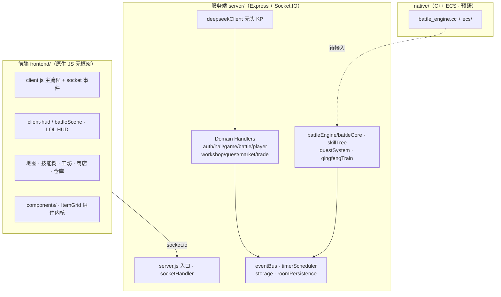

<p align="center">
  
</p>

> ## 🏷️ 版本封存公告
>
> 本仓库 `main` 现封存 **Web 页游版**（原生 HTML/CSS/JS 前端 + Node/Express/Socket.IO 服务器 + DeepSeek AI(KP)）。
>
> - 📦 封存提交/标签：`v2026.09-web-legacy`
> - 🌿 只读存档分支：`archive/web-page`
> - 🚧 下一步：项目将启动 **C++ + 游戏引擎（Epic 发布 · 饥荒式联机）桌面重构**，重构将在独立开发分支进行（此 Web 版仅作历史存档与玩法对照）。
> - ▶️ 运行本版：`npm install && npm start` → 浏览器访问 `http://localhost:3000`

---

<p align="center">
  
  
  
  
  
  
  
</p>

# 🌑 寂静之地 · The Silent Realm

> **多人联机 · 克苏鲁 TRPG · 跑团 RPG**
> 在青峰山的废弃列车与废都之中，与队友并肩调查未知的恐惧——由 **DeepSeek AI 担任 KP**，见证每一次掷骰的命运裁决。

一款功能完整的多人联机克苏鲁「寂静之地」题材 TRPG 游戏。后端为 **Node.js + Express + Socket.IO**，前端为**零依赖原生 HTML/CSS/JS**，内置**杀戮尖塔 2 式回合制战斗**、**13 种职业特殊机制**与 **C++ N-API ECS 原生引擎预研**。

---

## ✨ 特性总览

| 板块 | 亮点 |
| --- | --- |
| 🎲 **AI KP（无头 GM）** | DeepSeek 叙事演绎 · 探索行动裁决 · 回合值成本控制 · 敏感词过滤 |
| 🚂 **多人副本** | 青峰山虚空列车 · 废都 · 多车厢场景 · 移动探索 · 对讲机 / 线索 / 多结局 |
| ⚔️ **战斗系统** | 杀戮尖塔 2 式 · 意图气泡 · AP 能量骰 · 13 职业特殊机制 · 暴击 / 闪避 / 招架 |
| 🧙 **13 职业** | 方士 / 观星者 / 环法师 / 炼金术师 / 角斗士 / 骑士 / 百夫长 / 海盗 / 枪手 / 侦探 / 武士 / 诡术小丑 / 警官 |
| 🌲 **技能树** | 职业技能流派 · 节点解锁 · 详情浮窗 · 必备（innate）技能常驻 |
| 🏭 **经济系统** | 工坊锻造 / 强化 · 寄售 / 拍卖（紫+过滤）· 交易所 · 战利品三选一 |
| 🧠 **SAN / 异化** | 理智值系统 · 疯狂 · 全队异化结局判定 |
| 💾 **持久化** | 文件 JSON 存档 · 战斗落盘 · 断线重连恢复 |

---

## 🚀 快速开始

```bash
# 1. 安装依赖
npm install

# 2.（可选）构建原生 C++ 引擎（当前未接入，仅预研）
npm run build:native
npm run test:native

# 3. 启动服务器
npm start            # 或 node server.js

# 4. 浏览器访问
#    http://localhost:3000
```

### 测试

```bash
npm test             # node --test tests/*.test.js（24 项）
node tools/verify-mechanics.js   # 战斗职业机制引擎验证（招架/暴击/处决/装填…）
```

---

## 🏗 系统架构



| 层 | 说明 |
| --- | --- |
| **服务端** `server/` | ~9.7k 行 / 38 模块 · domain handler 模块化 + 事件驱动 |
| **前端** `frontend/` | ~12.6k 行 · 零依赖原生 JS，组件化推进中 |
| **原生** `native/` | C++ N-API ECS（entity / event_bus / system_factory） |
| **配置** `config/` | 13 职业 / 264 技能 / 怪物 / 物品 / 场景 / 副本 |
| **文档** `docs/` | 系统文档 · 战斗方案 · 副本设计 · 世界设定（26 份） |

---

## 📁 目录结构与模块 README

```
coc-rpg-game/
├─ server/     Node 服务端（handlers · 引擎 · 物品 · 持久化）  →  server/README.md
├─ frontend/   原生前端（大厅 · 地图 · 战斗 · 角色 · 工坊）    →  frontend/README.md
├─ native/     C++ N-API ECS 引擎（预研）                     →  native/README.md
├─ config/     数据配置中心（职业 · 技能 · 怪物 · 物品）        →  config/README.md
├─ docs/       设计与方案文档
├─ assets/     图片 / 立绘 / 图标 / 场景资源
├─ bgm/        背景音乐
├─ public/     封面页静态资源
├─ tools/      验证 / 演示脚本（verify-mechanics / demo-battle）→  tools/README.md
├─ tests/      自动化测试（node --test）
├─ data/       运行时数据（账号 / 存档 / 房间）
└─ .agent/     多 Agent 开发工作流（状态机 + 报告归档）
     .github/  Agent 定义
```

---

## 🎮 玩法简介

1. **创建调查员** —— 从 13 职业中选择，分配属性、选择技能树流派。
2. **组队进入副本** —— 青峰山虚空列车（G314），与队友共享探索回合。
3. **AI KP 叙事** —— 输入行动，DeepSeek 判定并推进剧情；探索消耗「回合值」。
4. **战斗** —— 进入有怪车厢触发杀戮尖塔 2 式战斗：掷能量骰 → 普攻/技能 → 敌人回合。
5. **成长与经济** —— 战利品三选一、锻造强化、寄售拍卖、技能解锁。
6. **结局** —— 收集线索、管理 SAN 值，走向多分支结局（或全队异化）。

---

## 🛠 技术栈

| 领域 | 技术 |
| --- | --- |
| 服务端 | Node.js · Express · Socket.IO · node-fetch |
| 数据 | 文件 JSON（storage / roomPersistence） |
| 前端 | 原生 HTML / CSS / JS（零框架）· Canvas |
| 原生 | C++（node-addon-api / N-API ECS）· node-gyp |
| AI | DeepSeek Chat（无头 KP）· sharp（图片处理） |
| 工作流 | 多 Agent 状态机（AGENTS.md）· HTML 报告归档 |

---

## 📚 文档索引（docs/）

战斗方案 · 职业机制 · 副本设计 · 世界设定 · 地图规范 · KP 配置说明 等 26 份，详见 [`docs/`](docs/)。

---

<p align="center"><sub>Made with 🖤 by asuperj1 · 寂静之地 · The Silent Realm</sub></p>
