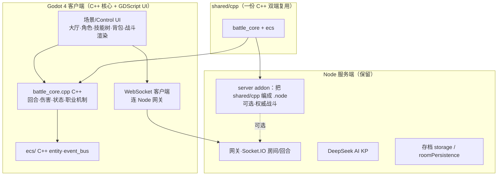

# C++ + 游戏引擎重构方案（寂静之地）

> 目标：用「游戏引擎 + C++」重构当前 Node/原生前端实现。本方案基于项目现状（2D 为主的多人联机 TRPG、AI KP 叙事、Node 服务端成熟、`native/` 已有 C++ ECS 预研）给出**推荐选型、架构、C++ 落点、VS Code 工作流、迁移路线与风险**。

---

## 〇、项目画像（决定选型）

| 维度 | 现状 | 对选型的约束 |
| --- | --- | --- |
| 玩法 | 2D 场景/立绘 + 大量 UI + 回合战斗 + AI 叙事 | **2D 引擎 + 强 UI 框架**为佳，3D 引擎过重 |
| 联机 | Socket 房间/回合/消息驱动（中低实时） | 客户端-服务器分离即可，无需帧同步 |
| 美术 | `assets/` 300MB / 956 个 2D PNG | 资源可直接迁移到引擎 |
| 服务端 | Node 38 模块：AI KP / 存档 / 房间 / 交易全成熟 | 重写成本高、收益低 |
| 原生预研 | `native/` C++ ECS + N-API 绑定（未接入） | 是 C++ 战斗核心的现成地基 |

---

## 一、引擎选型对比

| 方案 | 2D/UI 强度 | C++ 程度 | Web/桌面 | VS Code | 对本项目契合 | 结论 |
| --- | --- | --- | --- | --- | --- | --- |
| **Godot 4.x + C++（GDExtension）** | ★★★★★（Control/Container 一流） | 核心逻辑可写 C++，GDScript 做胶水 | 均支持（WASM 导出成熟） | 官方 VSCode 扩展 + LSP | UI 密集 + 2D 演出 + 回合战斗 | ✅ **推荐** |
| 自研纯 C++（SDL2/raylib+ECS） | 全自建（UI 成本极高） | 100% | 需自行封装 | CMake/Clangd | 本作 UI 极多，自建 UI 是硬伤 | 不推荐主路线 |
| Unreal（纯 C++） | 2D 支持弱、重型 | C++ | 桌面强/Web 弱 | 支持一般 | 2D TRPG 过重 | 不推荐 |
| Cocos Creator | 强 2D | 非 C++ 主体（TS） | 好 | 尚可 | 用户要 C++，不匹配 | 不推荐 |

**推荐：Godot 4.x（GDExtension C++ 写核心逻辑）。**

理由：
1. **2D + UI 是 TRPG 的主战场**：Godot 的 Control/Container、主题、场景树对"角色档案 8 标签/技能树/背包网格/工坊/商店"这类 UI 是顶级生产力；动画/立绘/意图气泡可复用现有视觉语言。
2. **C++ 有真正的落点**：把 `server/battleEngine.js` 的战斗核心移植为 **C++ `battle_core`**（复用 `native/ecs` 的 entity/event_bus/system_factory），以 **GDExtension** 编给 Godot 客户端；**同一份 C++ 再以 N-API 编成 `.node` 给 Node 服务端**——一次编写、双端复用，且把现有"已编译未接入"的 native 从沉没成本变成核心资产。
3. **多端**：一套工程导出 Web(WASM，保留浏览器访问习惯) + Windows 桌面；WebSocket 连 Node 现成。
4. 开源无授权、轻量、GDScript 让 UI/叙事脚本迭代极快。

---

## 二、推荐架构（Hybrid：引擎客户端 + 保留 Node 服务端）



要点：
- **服务端数据权威不变**：存档、房间、AI 判定继续由 Node 管（成熟、AI 集成现成）。客户端是"渲染 + 本地操作"。
- **C++ 核心双端复用**：`battle_core.cpp`（纯逻辑、无 IO）既编 Godot GDExtension，也编 Node addon —— 保证 JS 战斗引擎移植后与客户端**同源**，消除双实现分叉（对应此前审查的 P1）。
- 服务器是否也全 C++：**不建议**（成本/收益比差）；可后续把权威战斗放 Node+addon 已足够。

---

## 三、目录结构（VS Code 工作区，多根）

```
coc-rpg-game/                       # 保留：server/config/docs/assets…（Node 侧不动）
├─ client/                          # ★ 新增：Godot 4 工程
│  ├─ project.godot
│  ├─ scenes/                       # 大厅/角色/副本/战斗/背包… .tscn
│  ├─ gd/                           # GDScript（UI/网络胶水/叙事脚本）
│  ├─ core_cpp/                     # GDExtension C++ 包装（godot-cpp）
│  └─ assets_import/                # 指向 assets/ 的导入
├─ shared/
│  └─ cpp/                          # ★ C++ 双端核心
│     ├─ battle_core/               # 战斗引擎移植（纯逻辑，无引擎依赖）
│     ├─ ecs/                       # 迁移 native/ecs（entity/event_bus/system_factory）
│     ├─ CMakeLists.txt
│     └─ 与绑定目录分隔（build 输出不入库）
├─ native/                          # 原 N-API 预研 → 收编进 shared/cpp + server addon
└─ server/ …（保留）
```

- `shared/cpp` 用 **CMake**（单套 build 生成 GDExtension `.so/.dll` 与 Node `.node`，通过不同 target）。
- 提交策略：`shared/cpp` 由 git submodule 或独立目录引用 `godot-cpp`（不把 godot-cpp 塞进主仓）。

---

## 四、VS Code 工作流

| 用途 | 工具/扩展 |
| --- | --- |
| Godot 工程编辑 | **Godot Tools**（打开 `client/project.godot`，运行/调试场景） |
| GDScript | Godot LSP（Godot Tools 内嵌） |
| C++（GDExtension/Node addon） | **C/C++** + **clangd**（智能感知） + **CMake Tools** |
| 调试 | C++（gdb/lldb/vsdebug）；Godot 场景内调试 |
| 多根工作区 | 仓库根建 `code-workspace` 引入 `client/`、`shared/cpp`、`server`、根 |
| 构建任务 | `.vscode/tasks.json`：cmake 构建 GDExtension / node-gyp 构建 addon / npm start / Godot export |

典型命令：
```bash
# shared/cpp：构 Godot 扩展
cmake -S shared/cpp -B shared/cpp/build -DGODOT_CPP=...  && cmake --build shared/cpp/build
# Node addon（服务端权威战斗，可选）
node-gyp rebuild --directory=server/addon
# Godot
godot --path client --editor
# 导出 Web
godot --path client --export-release Web
```

---

## 五、迁移路线（并行渐进，不一次性重写）

| 阶段 | 内容 | 里程碑验证 |
| --- | --- | --- |
| **M0 PoC**（1–2 周） | Godot 工程壳 + WASM 导出 + WebSocket 连现有 Node；把 `server/battleEngine.js` 的**一个核心路径**（普攻/技能/状态）手写成 `shared/cpp/battle_core` 最小可跑，双端编译成功 | 浏览器(Godot Web)能进大厅并连服务器；C++ battle_core 在 Node addon 与 Godot 下输出一致 |
| **M1 大厅/房间/副本壳** | 用 Godot Control 重建大厅→房间→青峰山地图切换，复用 Node 的 `exploreRound/roomState` 事件；加载 `assets/` 立绘/场景 | 玩家可用 Godot 客户端跑完整副本探索+AI 叙事 |
| **M2 战斗** | `battle_core` 补全 13 职业机制（招架/处决/装填/暴击/闪避…，对照 `docs/职业特殊机制实装方案.md`）；Godot 渲染血条/意图/机制进度条 | C++ 战斗逻辑与现 JS 引擎逐条对拍（可用现有 `tools/verify-mechanics.js` 用例移植为 C++ 单测） |
| **M3 系统 UI** | 角色档案/技能树/背包/仓库/工坊/商店/寄售拍卖 在 Godot 重建 | 功能等价覆盖原前端 |
| **M4 打磨/多端** | Web 导出打磨、桌面包、性能（ECS 战斗热路径）、可选服务端权威战斗(Node+addon) | 正式迁移公告 |

> 全程保留 Node 服务端与现有 Web 前端可运行 → 可随时回退；Godot 客户端与旧前端并存，按用户可用性逐步切换。

---

## 六、风险与对策

| 风险 | 对策 |
| --- | --- |
| 前端 12640 行 JS UI 迁移量大 | 用"壳先行 + 系统分批（M1→M3）"；UI 重做非搬运（Godot 场景天然组件化） |
| C++ 战斗核心与 JS 引擎对拍偏差 | 移植时以 `tools/verify-mechanics.js` 用例为测试基线，写 C++ 单元测试逐条通过 |
| WASM 跨域连 Node | Node 开 CORS/同域部署，或统一 wss 网关；按原 `/api/*` 与 socket 协议对齐 |
| godot-cpp/GDExtension 学习成本 | 核心保持纯 C++（无 Godot 依赖），绑定层薄；GDScript 承担 UI 降低门槛 |
| 原 `native/ecs` 质量 | 收编进 `shared/cpp/ecs` 时先补单测再依赖 |

---

*关联：`server/battleEngine.js`、`native/ecs/`、`docs/职业特殊机制实装方案.md`、`.agent/reports/project-review-20260903-0805.html`（其中 P1"native 未接入/双实现"正是本方案要解决的）。*
