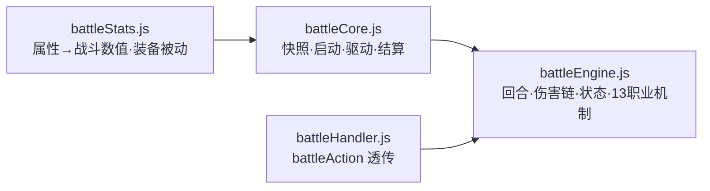

# 🗄 server/ — Node 服务端

> **Node.js + Express + Socket.IO** 服务端（~9.7k 行 / 38 模块），domain handler 模块化 + 事件驱动解耦。

## 🚀 启动

```bash
# 项目根目录
npm start          # node server.js
npm run dev        # nodemon（热重启）
```

入口 `server.js`（383 行）→ 装配 `socketHandler.js` 与各 domain handler，监听 `:3000`。

## 🏗 分层架构

| 层 | 模块 | 职责 |
| --- | --- | --- |
| **入口** | `server.js` · `socketHandler.js` | HTTP/静态/Socket 装配、断线恢复编排 |
| **Domain Handlers** | `authHandler` `hallHandler` `gameHandler` `battleHandler` `playerHandler` `workshopHandler` | 按业务域注册 socket 事件（auth/hall/game/battle/player/workshop/quest/market/trade） |
| **业务系统** | `gameLogic` `marketSystem` `tradeSystem` `questSystem` `skillTree` `gameVote` | 商店/交易/任务/技能树/投票 |
| **战斗引擎** | `battleEngine.js` `battleCore.js` `battleHandler`(battle) `battleStats.js` | 杀戮尖塔 2 式纯逻辑引擎 + 快照/驱动 + 属性数值 |
| **物品框架** | `itemEngine/`（ItemEngine/Factory/Registry/EquipmentSystem/EffectEngine/LootSystem/DungeonRegistry…） | 物品/装备/效果/掉落/副本清单 |
| **副本/AI** | `qingfengTrain.js` `qingfengEnding.js` `qingfengKnowledge.js` `dungeonFramework.js` `dungeonOutlines.js` | 青峰山剧本 / 结局 / 通用副本框架 |
| **AI KP** | `deepseekClient.js` | DeepSeek 无头 KP（叙事 / 判定） |
| **基础设施** | `eventBus.js` `eventTypes.js` `timerScheduler.js` `storage.js` `roomPersistence.js` `turnService.js` `logger.js` `state.js` `statResolver.js` `actionClassifier.js` `actionSystem.js` `playerItems.js` | 事件 / 回合调度 / 持久化 / 状态 / 属性解析 / 行动分类 |

## ⚔️ 战斗引擎



- **`battleEngine.js`**（847 行）：尖塔式队伍回合、意图系统、状态 11+、暴击/闪避/招架/装填/标记/正义处决、五段战姿、技能多段 hits、`battleExport/Restore/RemapSid/PlayerOffline` 断线恢复。
- **`battleCore.js`**：`buildPlayerSnapshot`（含 innate 必备技能强制出战 + mechanic 机制字段）、`startBattleForRoom`、`driveBattle`（有界循环）、`endBattle`（回写 HP/SAN + 战利品三选一）。
- 13 职业机制实装细节见 [`docs/职业特殊机制实装方案.md`](../docs/职业特殊机制实装方案.md)。

## 🔌 事件驱动

- `eventBus.js`：全局事件（`BATTLE_TURN` / `BATTLE_DAMAGE` / `BATTLE_DEATH` / `PLAYER_HP_CHANGED` / `ITEM_USED` …），事件类型统一在 `eventTypes.js`。
- `timerScheduler.js`：以「回合」为单位的定时调度，替代 sleep（buff 持续 / 技能 CD / 副本倒计时）。

## 💾 持久化

| 模块 | 作用 |
| --- | --- |
| `storage.js` | 文件 JSON 读写（`data/users.json`、`data/characters/*.json`、`data/market.json`） |
| `roomPersistence.js` | 房间状态落盘（含活动中的战斗 `battleExport` / `battleRestore`） |
| `state.js` | 线索→怪物真名解锁（克苏鲁未知恐惧）等全局状态 |

## 🧪 相关测试

- `tests/battleEngine.test.js` · `actionClassifier.test.js` · `dungeonFramework.test.js`
- 机制级验证：`tools/verify-mechanics.js`（招架 / 暴击回资源 / 多段 / 装填 / 标记 / 处决）

> 模块级 README 详见 [`frontend/README.md`](../frontend/README.md) 与仓库根 [`README.md`](../README.md)。
